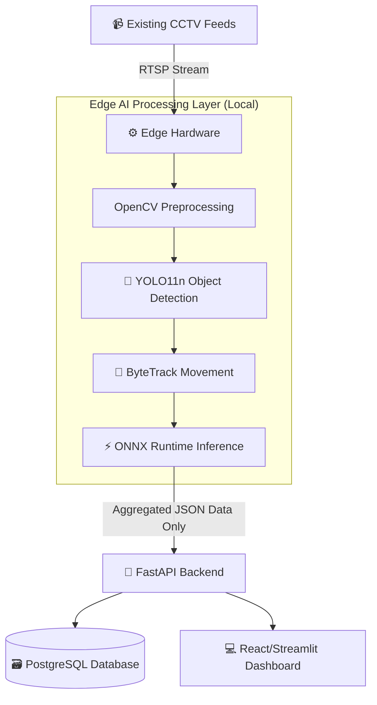

# 🛒 Retail IQ — *Edge AI for Smarter Retail*

> **🏆 AI & Computer Vision Portfolio Project**  
> **Domain:** RetailTech / Edge AI

---

## 📖 Executive Summary

**Retail IQ** is a state-of-the-art **Edge-AI powered retail monitoring platform** that converts existing CCTV camera feeds into real-time business intelligence. By pushing complex computer vision processing to the edge, we enable supermarkets and retail chains to automate repetitive monitoring, reduce checkout friction, and optimize store operations without relying on continuous high-bandwidth cloud connectivity.

Unlike generic analytics dashboards, Retail IQ is built with a **privacy-first, edge-native architecture** that focuses on actionable insights—such as shelf stock levels and queue lengths—while strictly avoiding facial recognition or PII storage.

---

## 🎯 The Problem Statement

Modern retail environments process massive amounts of visual information, but workflows still heavily rely on manual human observation:

### 1. The Operational Bottleneck 📉
- **Checkout Friction:** Unmonitored queue lengths lead to slow checkout journeys, frustrating customers and causing cart abandonment.
- **Empty Shelves:** Low or out-of-stock items go unnoticed during peak hours, directly translating to lost revenue.
- **Manual Monitoring:** Staff spend disproportionate amounts of time walking aisles just to check inventory and security.

### 2. The Bandwidth Trap 🌐
- **Cloud Dependency:** Streaming 24/7 high-definition CCTV footage from dozens of cameras to the cloud for AI processing requires massive, expensive bandwidth.
- **Latency:** Cloud round-trips delay time-critical alerts like sudden queue congestion.

### 3. Privacy Concerns 👁️
- **Shopper Privacy:** Customers are increasingly wary of in-store tracking, facial recognition, and potential misuse of personal biometric data.

---

## 💡 Our Solution: *Perceive, Understand, Act*

We built an intelligent layer that sits between existing cameras and store operations.

### 1. 📊 Shopper Analytics
- **Footfall & Heatmaps:** Tracks store entry/exit rates and dwell times.
- **Store Layout Optimization:** Identifies dead zones and high-traffic bottlenecks to improve merchandising.

### 2. 📦 Inventory Monitoring
- **Automated Shelf Observation:** Uses object detection to identify product classes and detect low/out-of-stock shelves.
- **Instant Alerts:** Triggers notifications for staff to restock specific aisles immediately.

### 3. 🚶 Queue Intelligence
- **Congestion Tracking:** Monitors queue lengths in real time.
- **Dynamic Staffing:** Alerts store managers to open new registers *before* customers become frustrated.

### 4. 🛡️ Privacy-First Edge Processing
- **No PII:** The system tracks anonymous shopper movement (blobs/bounding boxes), not faces.
- **Edge Inference:** Video is processed locally on the edge device. Only structured data (e.g., "Queue length is 5") and metadata are synced to the cloud.

---

## 🧠 Edge AI Methodology

### AI & Computer Vision Stack
- **YOLO11n:** Selected for real-time, high-density object detection on resource-constrained edge hardware. Capable of identifying multiple product classes on packed retail shelves simultaneously.
- **ByteTrack:** Utilized for multi-object tracking (MOT) to monitor anonymous shopper trajectories across frames without losing IDs during occlusion.
- **OpenCV:** Handles video stream ingestion, frame extraction, pre-processing, and dynamic Region of Interest (ROI) / Zone Analysis definition.

### Edge Inference & Optimization
- **Hardware Target:** Designed to run on MVP hardware (Raspberry Pi) with scalability to commercial Edge AI platforms (Qualcomm RB5/QCS-class).
- **ONNX Runtime:** Models are exported to ONNX for optimized, cross-platform execution, ensuring sub-50ms latency per frame.

---

## 🏗️ Technical Architecture

### Frontend (Dashboard & Portfolio)
- **Framework:** React 19 + TypeScript + Vite.
- **Styling:** CSS Modules, Modern CSS Custom Properties, Glassmorphism design tokens.
- **Motion:** Framer Motion for cinematic, scroll-triggered reveals and interactive demo simulations.

### Backend & Data Pipeline
- **API Engine:** FastAPI (Python) for handling telemetry and dashboard requests.
- **Database:** PostgreSQL for historical metrics, store-wise performance comparison, and reporting.

---

## 💰 Business Impact Analysis

Retail IQ creates measurable operational value by turning efficiency into revenue:

| Metric | Traditional Store | With Retail IQ |
|:-------|:------------------|:---------------|
| **Restock Response Time** | ~45 Minutes | **< 5 Minutes** (Automated Alert) |
| **Checkout Abandonment** | Moderate to High | **Low** (Proactive queue management) |
| **Cloud Bandwidth Cost** | High (Video Streaming) | **Minimal** (Text/JSON telemetry only) |
| **Staff Efficiency** | Reactive / Manual | **Targeted / Data-Driven** |

---

## 🔮 Future Roadmap

- [ ] **Phase 1 (Current):** Working prototype with core computer vision + detection capabilities.
- [ ] **Phase 2:** Advanced Retail Intelligence (Predictive analytics and historical trend reporting).
- [ ] **Phase 3:** Multi-camera synchronization and centralized multi-store management.
- [ ] **Phase 4:** Seamless POS/ERP Integration for automated inventory reconciliation.

---
*Developed as a premium portfolio showcase demonstrating the intersection of modern frontend engineering and Edge AI capabilities.*
